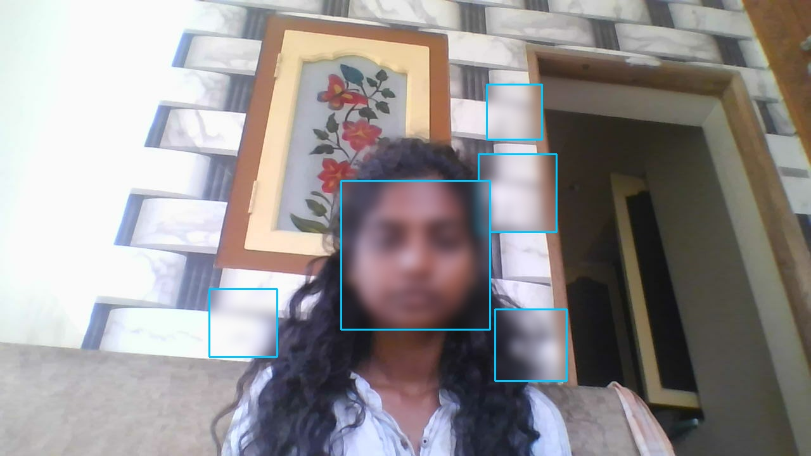
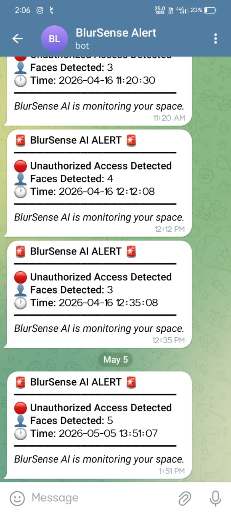

# 🔐 BlurSense AI – Privacy CCTV System

> Real-time face detection and automatic blurring for privacy-first surveillance, with instant Telegram alerts.

---

## Problem Statement

Public and private CCTV systems often capture and expose individuals' faces without consent, raising serious privacy concerns. Traditional surveillance setups lack automated privacy controls or real-time alerting.

BlurSense AI addresses this by automatically detecting and blurring faces in unauthorized mode, ensuring privacy compliance while keeping security teams informed through instant notifications.

---

## How It Works

1. Captures live video feed from a connected camera
2. Detects faces in each frame using OpenCV's real-time detection
3. Checks the current mode — **Authorized** or **Unauthorized**
4. In **Unauthorized** mode, automatically blurs all detected faces
5. Captures a snapshot and sends an instant alert via **Telegram**
6. Operator can toggle modes on the fly using keyboard controls

---

## 🚀 Features

- 🎯 Real-time face detection using OpenCV
- 🌫️ Automatic face blurring in unauthorized mode
- 📲 Instant Telegram alert notifications with snapshots
- 📸 Automatic snapshot capture on detection
- 🔄 Live mode switching — Authorized / Unauthorized
- 🪶 Lightweight and easy to deploy

---

## 🛠️ Tech Stack

| Layer | Technology |
|-------|-----------|
| Language | Python 3.8+ |
| Computer Vision | OpenCV (`opencv-python`) |
| Alerts | Telegram Bot API (`requests`) |
| Input | Webcam / IP Camera |

---

## ⚙️ Installation

**1. Clone the repository**

```bash
git clone https://github.com/roopika-m/blursense-ai.git
cd blursense-ai
```

**2. Install dependencies**

```bash
pip install -r requirements.txt
```

`requirements.txt`:
```
opencv-python>=4.8.0
requests>=2.31.0
```

**3. Configure Telegram alerts**

Add your Telegram Bot Token and Chat ID to the config section in `main.py`:

```python
TELEGRAM_BOT_TOKEN = "your_bot_token"
TELEGRAM_CHAT_ID   = "your_chat_id"
```

---

## ▶️ How to Run

```bash
python main.py
```

The live camera feed will open in a window. Use the keyboard controls below to operate the system.

---

## 🎮 Controls

| Key | Action |
|-----|--------|
| `A` | Switch to **Authorized** mode (faces visible, no alerts) |
| `U` | Switch to **Unauthorized** mode (faces blurred, alerts active) |
| `Q` | Quit the application |

---

## 📸 Output / Screenshot

### Unauthorized Mode — Faces Blurred


### Telegram Alert Notification



---

## 🔭 Future Scope

- Integrate a **Flask API** for remote mode switching and system control
- Build a **web dashboard** for live feed monitoring and alert history
- Add **cloud-based alert storage** (AWS S3 / Firebase) for snapshot archiving
- Support **multiple camera feeds** across locations
- Implement **role-based access control** for authorized user management
- Extend detection to include **object and motion-based** triggers

---

## 👩‍💻 About

**BlurSense AI** was built to explore the intersection of computer vision and privacy-first design in real-world surveillance systems.

**Author:** [Roopika M](https://github.com/roopika-m)  
**Language:** Python 100%


